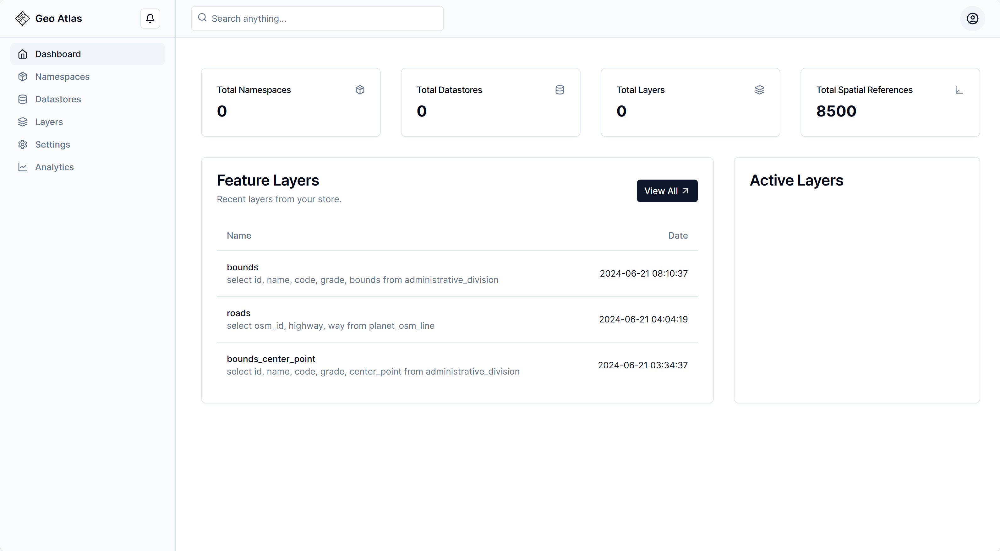
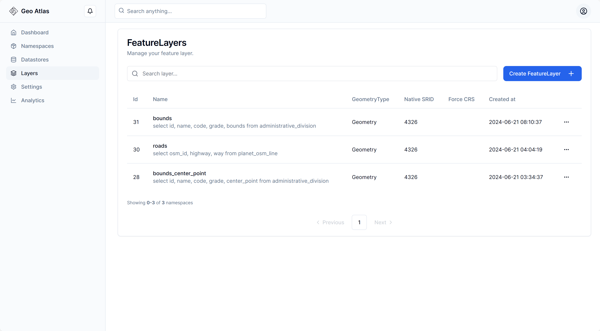
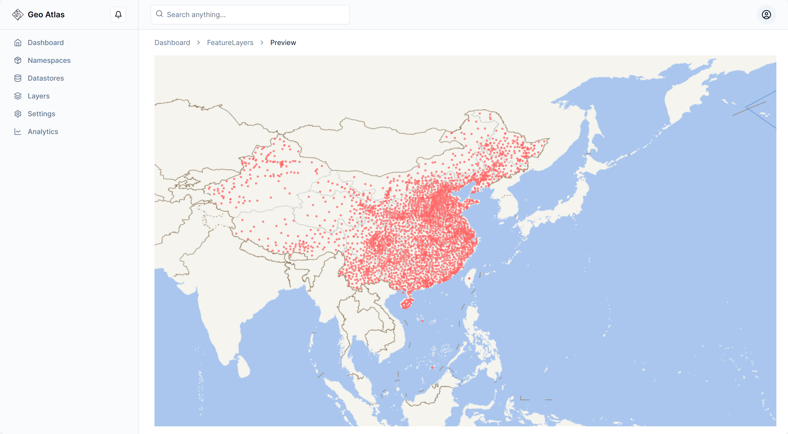
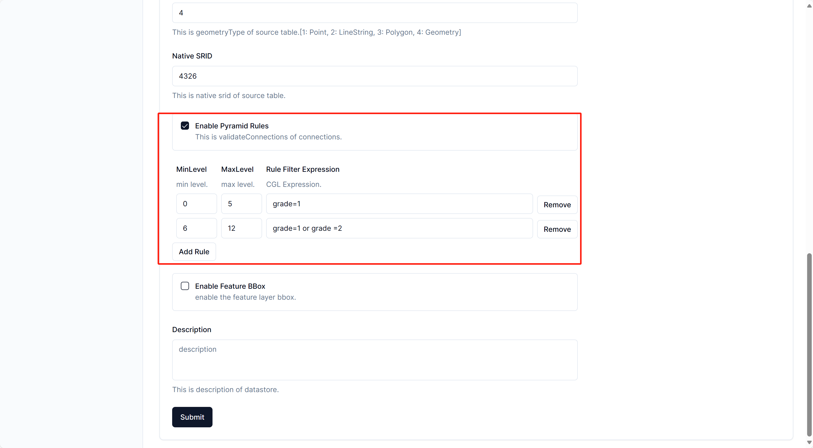
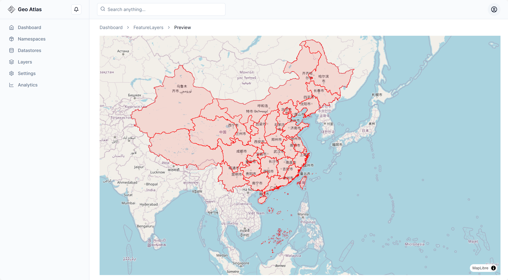
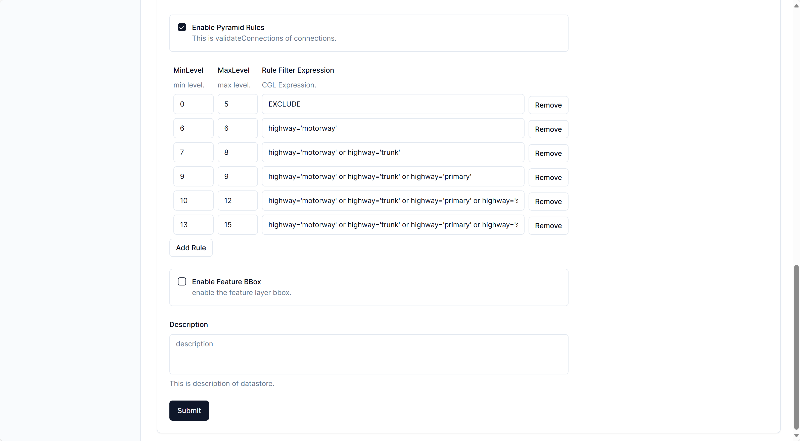
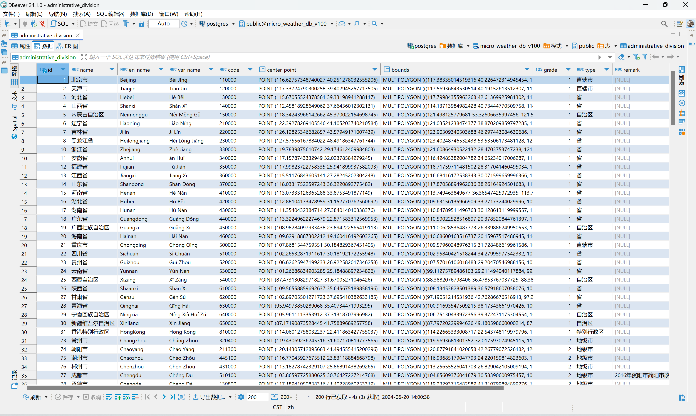
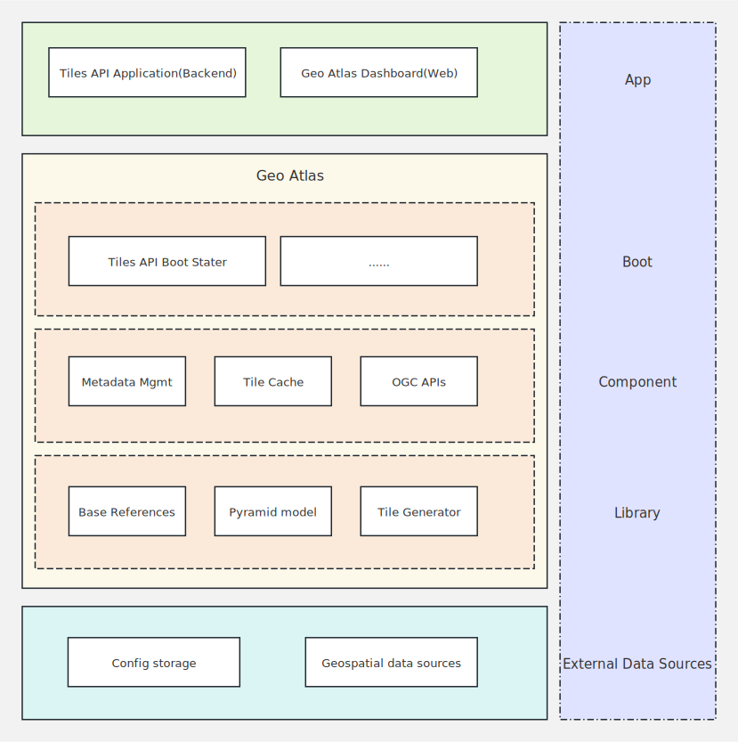
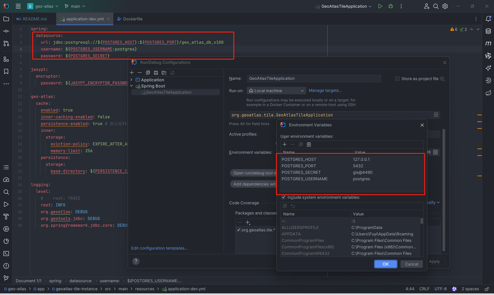

# Geo Atlas

<video src="./docs/video/geo-atlas-preview.mp4" controls="controls" width="100%" height=""></video>

## 介绍

[Geo Atlas](https://github.com/geoatlas-cloud/geo-atlas)，译为地理地图册(地理地图集)，就像小时候买到的纸质的地理地图册书本，里面填充着各式各样的地图。所以, 我也希望有那么一个东西，同样可以对外提供各种各样的地图以供使用。

目前来说，他还只是一个基于Java的开发的，可用于快速构建矢量切片服务的基础库。

> 本例中基于Geo Atlas实现了一个精简版本的矢量切片服务，从结果来看，可以将其看作为仅实现了矢量切片功能的GeoServer的精简提升版本。

## 背景和动机

首先，我是一个主做服务端开发的GIS开发工程师，平时接触最多的就是管网地图服务发布。此前的工作中没有使用任何平台技术，比如：ArcGIS、超图等，而是使用开源技术。技术栈大体可以总结为：SpringBoot + GeoServer + Mapbox + 空间数据库。

其次，目前在业务应用上，二维地图还是主流。而二维地图技术里面，属Mapbox Vector Tile的体验最好。所以，目前的技术路线是通过 GeoServer 来发布Vector Tile。

然后，在 GeoServer 使用中，我发现了这个几个问题：

- 受限于其开源协议（GPL 2.0）的约束，你无法通过修改部分源代码的方式，将其直接集成到系统内部。只能是单独部署，通过其提供的REST接口进行交互。基于此，部署方式同样受限。
- GeoServer 是一个大而全的东西，同时他是一个单体项目。也就是说，哪怕我只需要提供MWTS+MVT服务，我也需要部署一个全功能的节点，无法按需使用（这里不得不提一下GeoServer Cloud项目，但是它提出得要求更多了，需要一套微服务的环境）
- 从公谨[《WebGIS数据不切片或是时代必然》](https://zhuanlan.zhihu.com/p/512298212)一文推论，GeoServer中提供的MVT技术（指数据切片过程）已经算是切片起源时代的产物了，而今已经跨过了矢量切片时代（数据还是预切），进入了动态矢量切片时代了
- GeoServer中Vector Tile与GeoWebcache中的Tile Meta技术有冲突，瓦片清理存在BUG。可以理解为，GeoServer对于矢量瓦片的支持并不是很好。
- 不能很好的处理瓦片缓存与动态业务数据的矛盾，即使GeoWebcache提供缓存清理的策略。（Layer中Boundingbox范围问题）

> GeoServer完全是栅格金字塔技术的实现，不过是将栅格金字塔技术同时应用在栅格数据和矢量数据上，同时他并没有很好的针对不同层级对数据进行抽稀简化（其尝试从服务端配图SLD中获取数据分级规则，我没有测试过，但反对，理由参见: [关于矢量瓦片技术支持前端渲染带来的思考](https://fuyi-atlas.github.io/posts/gis/thoughts-on-mvt-front-end-rendering/)），那么就出现了一个pbf有近20M的情况。同时也回答了为什么现在大家都直接在数据库层面实现矢量瓦片（或者说是在数据源中），一是可以无视数据传递的时间损耗；二是可以直接做抽稀简化，这样出去的数据少了，传输速度自然也快了；三是数据库空间支持已经很成熟了；四是门槛高啊（护城河）

最后，我也想对我目前的状态做一次总结。那么，Geo Atlas应该就是我最好的总结方式。因为它既可以丰富我的简历🫣，又可以帮助我绘制技能树，完成这一次的总结。

---

ps: 当然，还有当下信创的背景原因。就当，抛砖引玉了😧，哈哈哈😬

## 状态

不定期更新...

## 特性

- [x] 遵循 [OGC Two Dimensional Tile Matrix Set and Tile Set Metadata Standard 2.0](https://docs.ogc.org/is/17-083r4/17-083r4.html) [并不完全遵循]
- [ ] 尝试遵循 [NEW OGC API](https://ogcapi.ogc.org/#standards)
- [x] 提供矢量切片能力
- [x] 支持自定义数据属性分级规则
- [x] 支持Google瓦片坐标系(原点在左上角, 默认即为Google瓦片坐标系)
- [x] 支持3857(900913), 4490投影(即默认提供相应的TileMatrixSet)
- [ ] 支持自定义坐标系及自定义坐标转换行为(源数据坐标系)
- [x] 支持自定义数据范围(OGC TileMatrixSet Limits，拒绝范围外请求)
- [x] 提供全局统一的，可快速集成的瓦片缓存组件， 
- [x] 支持基于内存和文件系统的缓存
- [ ] 支持使用GeoPackage进行缓存
- [x] 支持Seed, Reseed, Truncate三种瓦片缓存处理策略
- [x] 提供Namespace, Datastore, FeatureLayer元数据管理模块，并提供一个可视化操作界面(Geo Atlas Dashboard)
- [ ] 提供栅格数据切片能力
- [ ] 提供地形数据切片能力
- [x] 提供按需快速集成能力(将常用功能封装为各种stater)

## 截图









## 快速开始

以下说明旨在基于Docker技术快速搭建一个矢量切片服务示例。

- Geospatial Data Source(With some data)
  
  > 💡 <font style="color:red">提供下载的是矢量数据，不是最终地图，与符号化后的地图再可视化表达上存在一定差异。用户利用此数据编制地图，应当严格执行《地图管理条例》有关规定；编制的地图如需向社会公开的，还应当依法履行地图审核程序。</font>

  > 💡 <font style="color:orange"> 数据仅供学习研究使用</font>
- Tiles API Service(Backend)
- Geo Atlas Dashboard(Frontend)

> 请确保你已经安装好了Java, Maven, Docker以及Docker Compose。
> 我测试使用Wsl2(Windows11) + Docker Desktop(4.30.0) + Apache Maven 3.8.7 + Oracle jdk 11.0.20

1. 克隆代码
    ```shell
    git clone --recursive https://github.com/geoatlas-cloud/geo-atlas.git
    cd geo-atlas/
    ```
2. 配置环境变量
    ```shell
    cp .env.production.local.template .env.production.local
    ```
   然后手动修改配置文件, 将其中的配置项修改为你自己的配置，如:

   - HOST_IP：宿主机IP
   - POSTGRES_PASSWORD：PostgreSQL数据库初始化密码
   - JASYPT_ENCRYPTOR_PASSWORD：用于加密数据库账户信息的密钥
   - CACHE_ENABLED：是否开启缓存
   - NEXT_PUBLIC_BASE_MAP_TYPE：地图类型, osm|tianditu
   - NEXT_PUBLIC_BASE_MAP_TILE_KEY：当使用天地图时需要填写key，4490经纬度投影默认使用天地图，如果需要进行4490经纬度投影预览还请填写天地图Key
   
3. 执行构建脚本, 拉起服务

    ```shell
    chmod +x ./build2run.sh
    ./build2run.sh
    ```
等待服务启动完成后访问: http://localhost:11003, 而后按照GeoServer的使用习惯, 逐步创建
- namespace
- datastore
- feature layer
可通过预览的方式检查瓦片服务是否正常

> 默认给出的数据为我国的境界与政区数据, 来自[省市县数据CTAmap](https://www.shengshixian.com/), 源自[1：100万公众版基础地理信息数据（2021）](https://www.webmap.cn/commres.do?method=result100W)
> 其实我也曾提取过境界与政区数据([全国1:100万基础地理信息数据-境界与政区提取](https://fuyi-atlas.github.io/posts/program/micro-weather/006/)), 不过与上述数据相比而言比较粗糙, 后由于时间关系没有进行细化, 所以没有使用
> 
> 在提供境界与政区数据的同时, 还支持切换为[OSM China](https://hub.docker.com/repository/docker/threadzhou/ga-geospatial-osm-china/general)的数据。 OSM-China数据的处理过程大致为: 将源数据通过Osm2pgsql入库, 而后使用pg_dump制作转储文件, 并基于此转储文件制作PostGIS镜像, 在容器初始化的时候会自动恢复数据。
> 但是转储后的文件比较大, 导致镜像也比较大, 同时数据比较多导致恢复的时候比较慢。如果将其作为示例中的数据源的话, 那么三个服务全部启动完成耗时估计得有5分钟了, 所以并未将其作为默认得数据源。
> 
> 如果你想要使用OSM的数据测试, 可以将其作为额外的数据源进行连接, 这样就不会影响示例应用的初步体验了

### 指南

点击图片跳转B站

[](https://www.bilibili.com/video/BV1oAgSenEq5/?vd_source=a3d6ac851199bb1b577a99305af58486)

## 技术概览

基于GeoTools、GeoWebCache进行Geo Atlas构建，基于Spring Boot Framework对外提供快速集成能力。

- GeoTools提供矢量数据读取以及坐标转换能力
- 在此对GeoWebCache进行了拆分为两个部分：分别是金字塔(pyramid, 提供瓦片索引与瓦片生成能力)与瓦片缓存(tile-cache, 提供瓦片缓存能力)

> Mapbox Vector Tile Generator 由 [java-vector-tile](https://github.com/ElectronicChartCentre/java-vector-tile) 提供支持

### 系统架构概述

下图描述了系统的总体架构。



> 此处更多的表达了内部结构与层次关系，无关部署

### 组件概述

- APP
  - Geo Atlas Dashboard: 可视化操作界面
  - Tiles API Application: 提供矢量切片服务的应用程序(同时支持Dashboard)

- Boot
  - Tiles API Boot Stater: 对Tiles API的快速集成封装, 约定大于配置

- Component
  - Metadata Mgmt: 提供Namespace, Datastore, FeatureLayer元数据管理模块
  - Tile Cache: 提供瓦片缓存能力, 目前支持基于内存, 文件系统两种缓存方式, 可任意组合
  - OGC APIS: 提供OGC APIs, 目前仅支持Tiles API

- Library
  - Base References: 基础依赖声明
  - Pyramid Model: 金字塔模型, 用于构建瓦片金字塔结构索引, 同时提供切片管道
  - Tile Generator: 瓦片生成器, 目前仅支持Mapbox Vector Tile Generator

- External Data Sources
  - Config Storage: 用于存储Namespace, Datastore, FeatureLayer等元数据
  - Geospatial Data Source: 用于存储矢量数据, 如PostGIS、SQLServer

## 构建

### Requirements:

- Java >= 1.8 JDK

- Maven >= 3.6.3?

- Docker version >= 19.03.3?

- docker-compose version >= 1.26.2?

我不能很好的把握Maven和Docker的版本, 我自己的开发环境如下:

- OS: Windows 11(已开启WSL 2)
- IDE: IntelliJ IDEA 2023.2.3
- JDK: Amazon Corretto 1.8.0_412 | Oracle jdk1.8.0_241
- Maven: Apache Maven 3.9.2(使用IDEA 自带的Maven)
- Docker Desktop: 4.30.0

### Build

1. 克隆代码
    ```shell
    git clone https://github.com/geoatlas-cloud/geo-atlas.git
    cd geo-atlas/
    ```
2. 要构建应用程序，请从根项目目录运行以下命令, 或者使用IDEA的Maven插件

    ```shell
    mvn clean install -DskipTests
    ```

### Running

1. 配置环境变量, 默认使用dev环境(当然，你可以直接修改dev.yml文件, 而不是通过环境变量控制)

   

2. 自行用IDEA打开项目，然后运行Application类。

## 支持
- thread.zhou@gmail.com
- thread_zhou@126.com

## 声明与致谢

- Geo Atlas现版本参照[GeoServer](https://github.com/geoserver/geoserver)应用模式构建，并参考了[GeoServer](https://github.com/geoserver/geoserver)以及[GeoServer Cloud](https://github.com/geoserver/geoserver-cloud)的实现方式
- Pyramid、IO(in Library)、Tile Cache模块均来自GeoWebCache, 是对其进行了拆解和少量变更
- 矢量数据的读取与坐标转换使用GeoTools
- Mapbox Vector Tile Generator由 [java-vector-tile](https://github.com/ElectronicChartCentre/java-vector-tile) 提供支持

## 版权许可
[LGPL-3.0 license](./LICENSE)

版权所有 (c) 2024-至今，Geo Atlas。
